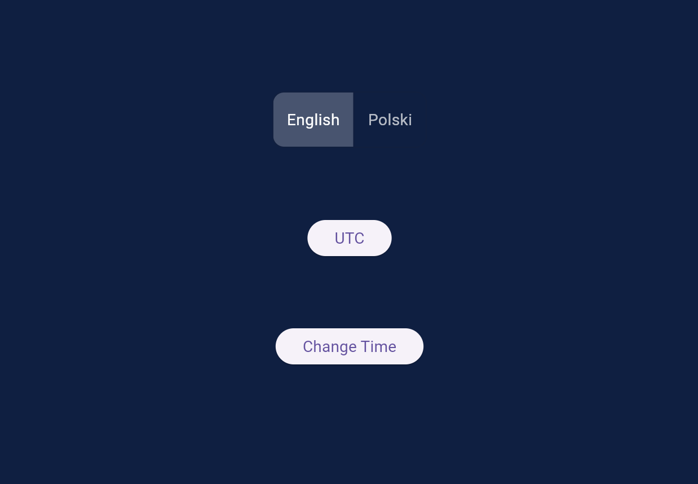
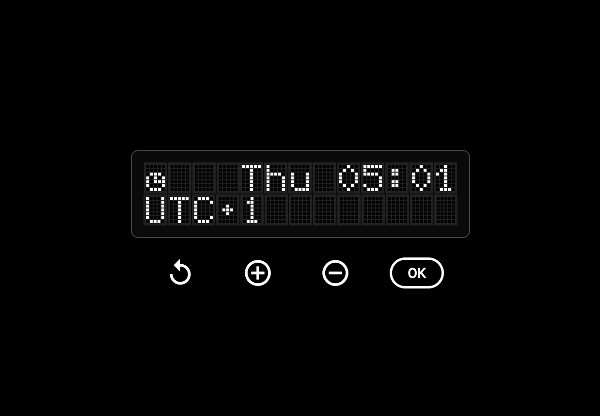
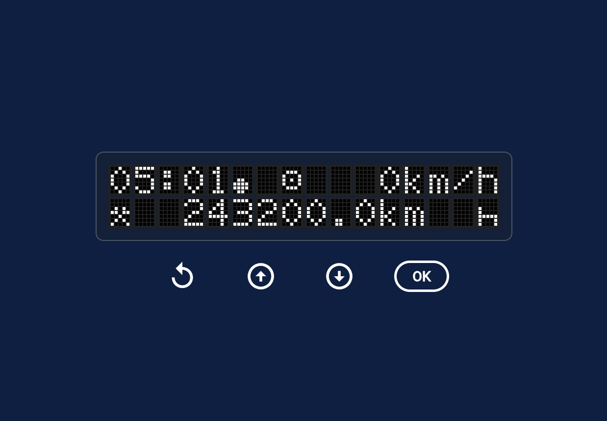

# FL Digital Tachograph v2

Flutter app that simulates digital tachograph style screens, including UTC view, change-time flow, and language switching (English/Polski).

## Preview

<p align="center">
  <a href="assets/options_view.png">
	
  </a>
  <a href="assets/utc_view.png">
	
  </a>
  <a href="assets/change_time_view.png">
	
  </a>
</p>

<p align="center">
  <strong>Options View</strong> &nbsp;•&nbsp; <strong>UTC View</strong> &nbsp;•&nbsp; <strong>Change Time View</strong>
</p>

Click any screenshot to open the full-size image.

`docs/config/gradle.properties.example` contains a docs-safe Gradle template matching your local setup pattern.

## Features

- Pixel-grid tachograph inspired UI widgets
- Dedicated `UTC` screen
- Multi-step `Change Time` screen flow
- Language switch: `English` / `Polski`
- Navigation starts from `OptionsView`

## Project Structure

- `lib/main.dart` - app entry point, routes, language scope
- `lib/options_view.dart` - start screen with language + navigation buttons
- `lib/time/just_utc/utc_view.dart` - UTC screen
- `lib/time/change_time/` - change-time screens and flow
- `lib/language/language_manager.dart` - labels and language handling
- `lib/widgets/` and `lib/pictograms/` - reusable UI and icon/char grids
- `assets/` - app screenshots and Flutter image assets
- `docs/config/` - non-sensitive config examples

## Run Locally

```bash
flutter pub get
flutter run
```

## Verify

```bash
flutter analyze
flutter test
```

## Requirements

- Flutter SDK (stable)
- Dart SDK (comes with Flutter)
- Android Studio / Xcode depending on target platform

## License

This project is licensed under the MIT License.

You are free to use, copy, modify, and share the whole project or separate parts of it, as long as the MIT license notice is kept with substantial portions of the code.

See [`LICENSE`](LICENSE) for details.
